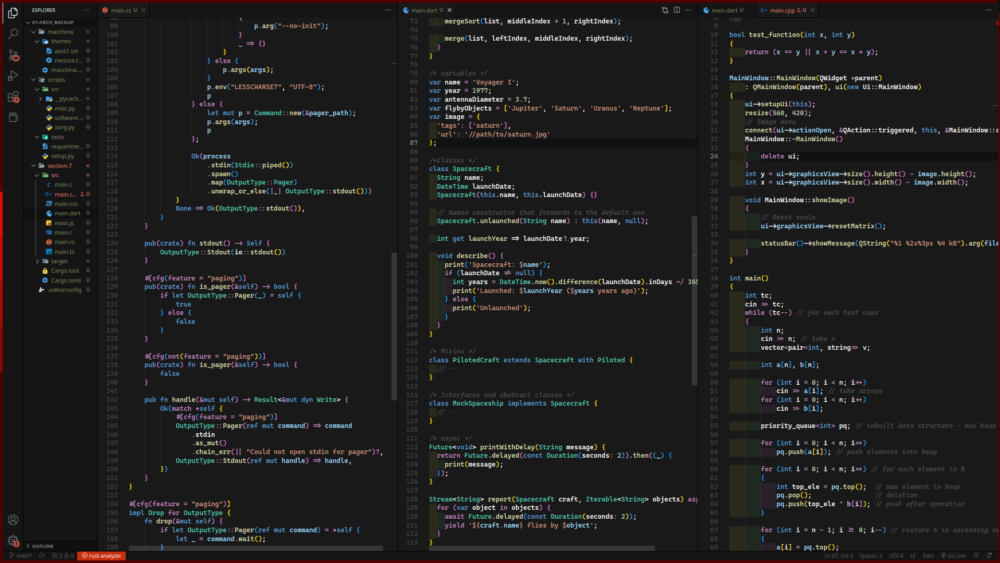

# Kadaxi vscode theme.

Personally I think default vscode theme it's too pretty, but something that doesn't add up at all it's the dark palette around the editor (sidebar, status bar colors, etc), then it came to me that maybe I could merge material and default theme, making few changes and adding languages support, hope you enjoy it, happy coding.

## Installation
### First way
Paste the following command `ext install kadaxi.kadaxi-dark-theme` in VS Code Quick Open `Ctrl+P`, and press Enter.
### Second way
Inside vscode open extensions menu with `Ctrl + Shift + X`, after fill input box with `kadaxi dark @recentlyPublished` and click on install.

> **Note.** At installation will prompt a box to change theme, just press enter. Remember that you can also check this theme at microsoft marketplace [link](https://marketplace.visualstudio.com/items?itemName=kadaxi.kadaxi-dark-theme).

## Override this theme.
Under development...

## Contribute
Under development...

## Inspiration
- [material theme](https://github.com/material-theme/vsc-material-theme.git).
- [dark-plus-syntax](https://github.com/tcd/dark-plus-syntax.git).
- [bat samples](https://github.com/sharkdp/bat/issues/1213).
